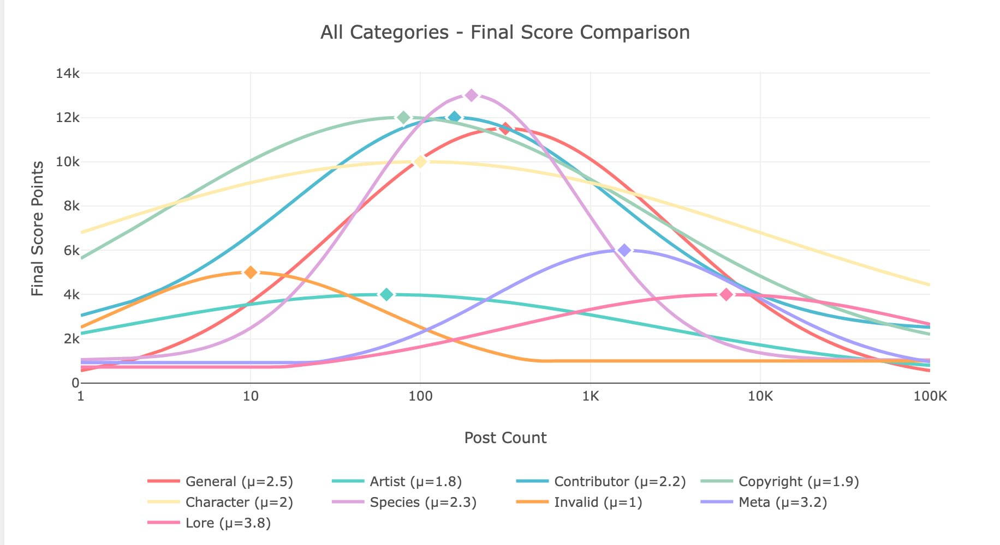

# e621_guessr

[](https://svelte.dev)
[](https://www.typescriptlang.org)
[](https://vitejs.dev)
[](https://nodejs.org)
[](https://expressjs.com)
[](https://plotly.com/javascript/)
[](https://runed.dev)

---

## what is this?

e621_guessr is a game which tests your knowledge of furry art tags. 
high scores are awarded to interesting, rare, and contextually important tags.

if you don't know what e621 is.. forget you ever saw this.
you must be 18 years or older to play !

---

## installation

### prerequisites
- node.js (v18 or newer recommended)
- npm (comes with node.js)

### install node.js and npm (macOS with homebrew)
- open a terminal
- install [homebrew](https://brew.sh) if you don't have it:
  ```
  /bin/bash -c "$(curl -fsSL https://raw.githubusercontent.com/Homebrew/install/HEAD/install.sh)"
  ```
- install node (includes npm):
  ```
  brew install node
  ```
- check installation:
  ```
  node -v
  npm -v
  ```
  both should print a version number

### install node.js and npm (other OS)
- go to [nodejs.org](https://nodejs.org)
- download the "LTS" version for your OS
- run the installer
- open a terminal and check:
  ```
  node -v
  npm -v
  ```
  both should print a version number

### clone the repo
```
git clone https://github.com/awonomo/e621_guessr.git
cd e621_guessr
```

### install dependencies
```
npm install
cd backend
npm install
```

### setup the backend (first time only)
```bash
cd backend
# Complete setup (database + tag data)
npm run setup

# Or if you prefer to do it step by step:
npm run db:init      # Initialize database schema
npm run tags:refresh # Download tag data from e621
```

---

## running locally

### start the backend (api server)
```
cd backend
npm run dev
```

### start the frontend (vite dev server)
```
cd ..
npm run dev
```

- open your browser to [http://localhost:5173](http://localhost:5173)
- the backend runs on [http://localhost:3001](http://localhost:3001)

---

## scoring system overview



tags are scored based on a rarity, relevance, and context:
- tag categories have their own minimum scores and weighted curves
- each category has a rarity sweet spot
- contextual multiplier system aims to dampen and boost general tags based on patterns (tags pertaining to color for instance)


---

## roadmap
- create more game modes
- add leaderboard
- host it publicly
- settings
- statistics screen
- add more tags and tag contexts to the scoring multipliers
- UI sounds
- UI effects for high scoring tags
- UI response to incorrect and/or repeated guesses
- add a share feature to game summary
- local multiplayer with kahoot/jackbox style audience input

---